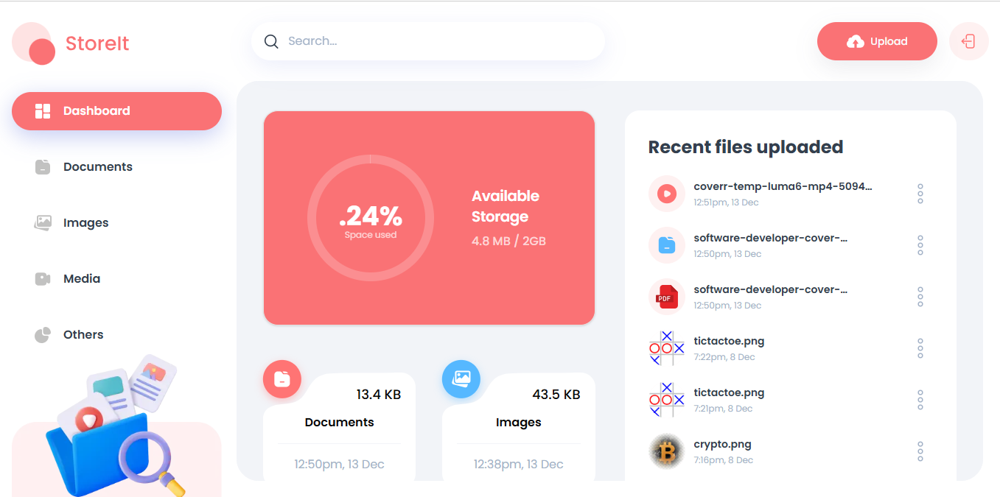

This is a [Next.js](https://nextjs.org) project bootstrapped with [`create-next-app`](https://nextjs.org/docs/app/api-reference/cli/create-next-app).

## Getting Started

First, run the development server:

```bash
npm run dev
# or
yarn dev
# or
pnpm dev
# or
bun dev
```

Open [http://localhost:3000](http://localhost:3000) with your browser to see the result.

You can start editing the page by modifying `app/page.tsx`. The page auto-updates as you edit the file.

This project uses [`next/font`](https://nextjs.org/docs/app/building-your-application/optimizing/fonts) to automatically optimize and load [Geist](https://vercel.com/font), a new font family for Vercel.

## Learn More

To learn more about Next.js, take a look at the following resources:

- [Next.js Documentation](https://nextjs.org/docs) - learn about Next.js features and API.
- [Learn Next.js](https://nextjs.org/learn) - an interactive Next.js tutorial.

You can check out [the Next.js GitHub repository](https://github.com/vercel/next.js) - your feedback and contributions are welcome!

## Deploy on Vercel

The easiest way to deploy your Next.js app is to use the [Vercel Platform](https://vercel.com/new?utm_medium=default-template&filter=next.js&utm_source=create-next-app&utm_campaign=create-next-app-readme) from the creators of Next.js.

Check out our [Next.js deployment documentation](https://nextjs.org/docs/app/building-your-application/deploying) for more details.


## 🖼️ Preview

### Login Page


### signup Page


### OTP mail


### Entering OTP


### Uploading file


### Dashboard



Store it

A storage management and file sharing platform that lets users effortlessly upload, organize, and share files. Built with the latest Next.js 15 and the Appwrite Node SDK, utilizing advanced features for seamless file management.

⚙️ Tech Stack
React 19
Next.js 15
Appwrite
TailwindCSS
ShadCN
TypeScript


🔋 Features
👉 User Authentication with Appwrite: Implement signup, login, and logout functionality using Appwrite's authentication system.

👉 FIle Uploads: Effortlessly upload a variety of file types, including documents, images, videos, and audio, ensuring all your important data.

👉 View and Manage Files: Users can browse through their uploaded files stored in Appwrite storage, view on a new tab, rename file or delete.

👉 Download Files: Users can download their uploaded files giving them instant access to essential documents.

👉 File Sharing: Users can easily share their uploaded files with others, enabling collaboration and easy access to important content.

👉 Dashboard: Gain insights at a glance with a dynamic dashboard that showcases total and consumed storage, recent uploads, and a summary of files grouped by type.

👉 Global Search: Users can quickly find files and shared content across the platform with a robust global search feature.

👉 Sorting Options: Organize files efficiently by sorting them by date, name, or size, making file management a breeze.

👉 Modern Responsive Design: A fresh and minimalist UI that emphasizes usability, ensuring a clean aesthetic across all devices.

### Folder Structure

app/
  (auth)
    /sign-in
      page.tsx
    /sign-up
      page.tsx
    layout.tsx
  (root)
    [type]
      page.tsx
    layout.tsx
    page.ts
/public
  /assets
components/
  ActionDropdown.tsx
  ActionsModalContent.tsx
  Card.tsx
  FileUploader.tsx
  Header.tsx
  MobileNavigation.tsx
  Search.tsx
  Sidebar.tsx
  Thumbnail.tsx
  ui/ # shadcn components
    button.tsx
    dialog.tsx
    dropdown-menu.tsx
    input.tsx
    sheet.tsx
    toast.tsx
    ...
lib/
  actions/
    file.actions.ts
      export {uploadFile,getFiles,renameFile,updateFileUsers,deleteFile};
    user.actions.ts
      export {createAccount,verifySecret,sendEmailOTP,getCurrentUser,signOutUser,signInUser};
  appwrite/
    config.ts
    index.ts
  utils.ts
hooks/
  use-toast.ts
types/
  index.d.ts
constants/
  index.ts


Code snippets

Appwrite session and setting up nextjs cookies
```
"use server";
import { Account, Avatars, Client, Databases, Storage } from "node-appwrite";
import { appwriteConfig } from "./config";
import { cookies } from "next/headers";

/**
 * Creates an Appwrite client with the session set from the session cookie.
 *
 * This function throws an error if the session cookie is not set.
 *
 * @returns An Appwrite client with the session set and shortcuts to the
 * Account and Databases services.
 */
const createSessionClient = async () => {
  // Create an Appwrite client instance
  const client = new Client()
    .setEndpoint(appwriteConfig.endpointUrl) // The Appwrite endpoint
    .setProject(appwriteConfig.projectId); // The Appwrite project ID

  // Get the session cookie
  const session = (await cookies()).get("appwrite-session");

  // If there is no session cookie, throw an error
  if (!session || !session.value) throw new Error("No session");

  // Set the session on the client
  client.setSession(session.value);

  // Return a client with methods for the Account and Databases services
  return {
    // A shortcut to the Account service
    get account() {
      return new Account(client);
    },
    // A shortcut to the Databases service
    get databases() {
      return new Databases(client);
    },
  };
};

/**
 * Creates an Appwrite client with the Appwrite secret key set. This client can
 * be used to perform administrative tasks like creating users, creating
 * databases, and creating storage buckets.
 *
 * @returns An Appwrite client with methods for the Account, Databases, Storage,
 * and Avatars services.
 */
const createAdminClient = async () => {
  const client = new Client()
    .setEndpoint(appwriteConfig.endpointUrl) // The Appwrite endpoint
    .setProject(appwriteConfig.projectId) // The Appwrite project ID
    .setKey(appwriteConfig.secretKey); // The Appwrite secret key

  // Return a client with methods for the Account, Databases, Storage, and
  // Avatars services. This client is set up with the Appwrite secret key, so it
  // can be used to perform administrative tasks.
  return {
    // A shortcut to the Account service
    get account() {
      return new Account(client);
    },
    // A shortcut to the Databases service
    get databases() {
      return new Databases(client);
    },
    // A shortcut to the Storage service
    get storage() {
      return new Storage(client);
    },
    // A shortcut to the Avatars service
    get avatars() {
      return new Avatars(client);
    },
  };
};

export {
  createSessionClient,
  createAdminClient
}
```
file.actions.ts

```ts
"use server";

import { DeleteFileProps, FileType, GetFilesProps, RenameFileProps, UpdateFileUsersProps, UploadFileProps } from "@/types";
import { appwriteConfig } from "@/lib/appwrite/config";
import { createAdminClient, createSessionClient } from "../appwrite";
import { ID, Models, Query } from "node-appwrite";
import { constructFileUrl, getFileType, parseStringify } from "../utils";
import { revalidatePath } from "next/cache";
import { InputFile } from "node-appwrite/file";
import { getCurrentUser } from "@/lib/actions/user.actions";


/**
 * Logs the given error and message to the console and re-throws the error
 * to be handled by the caller.
 * @param error The error to log and re-throw
 * @param message The message to log
 */
const handleError = (error: unknown, message: string) => {
  console.log(error, message);
  throw error;
};

/**
 * Creates an array of queries that can be used to filter and sort files in Appwrite.
 * The queries are as follows:
 * 1. `Query.or` that matches files where the owner is the current user or the
 *    current user is listed in the `users` array.
 * 2. `Query.equal` that matches files where the `type` field is one of the given types.
 * 3. `Query.contains` that matches files where the `name` field contains the given search text.
 * 4. `Query.limit` that limits the number of files returned to the given limit.
 * 5. `Query.orderAsc` or `Query.orderDesc` that sorts the files by the given field in ascending or descending order.
 * @param currentUser The current user document
 * @param types The types of files to filter by
 * @param searchText The text to search for in the file names
 * @param sort The field to sort by and the order of the sort
 * @param limit The maximum number of files to return
 * @returns An array of queries that can be passed to `listDocuments` to filter and sort files
 */
const createQueries = (
  currentUser: Models.Document,
  types: string[],
  searchText: string,
  sort: string,
  limit?: number
) => {
  const queries = [
    // Match files where the owner is the current user or the current user is listed in the users array
    Query.or([
      Query.equal("owners", [currentUser.$id]),
      Query.contains("users", [currentUser.email]),
    ]),
  ];

  if (types.length > 0) {
    // Match files where the type is one of the given types
    queries.push(Query.equal("type", types));
  }

  if (searchText) {
    // Match files where the name contains the given search text
    queries.push(Query.contains("name", searchText));
  }

  if (limit) {
    // Limit the number of files returned to the given limit
    queries.push(Query.limit(limit));
  }

  if (sort) {
    // Sort the files by the given field in ascending or descending order
    const [sortBy, orderBy] = sort.split("-");

    queries.push(
      orderBy === "asc" ? Query.orderAsc(sortBy) : Query.orderDesc(sortBy)
    );
  }

  return queries;
};


/**
 * Uploads a file to Appwrite and creates a corresponding document in the
 * files collection.
 * @param file The file to upload
 * @param ownerId The ID of the user who owns the file
 * @param accountId The ID of the account that the file belongs to
 * @param path The path to revalidate after uploading the file
 */
async function uploadFile({
  file,
  ownerId,
  accountId,
  path,
}: UploadFileProps) {

  const { storage, databases } = await createAdminClient();
  console.log({ file, ownerId, accountId });

  try {
    // Create an InputFile from the given File object
    const inputFile = InputFile.fromBuffer(file, file.name);

    // Upload the file to Appwrite
    const bucketFile = await storage.createFile(
      appwriteConfig.bucketId,
      ID.unique(),
      inputFile,
    );

    // Create a document in the files collection with the given properties
    const fileDocument = {
      type: getFileType(bucketFile.name).type,
      name: bucketFile.name,
      url: constructFileUrl(bucketFile.$id),
      extension: getFileType(bucketFile.name).extension,
      size: bucketFile.sizeOriginal,
      owners: ownerId,
      accountId,
      users: [],
      bucketFileId: bucketFile.$id,
    };

    // Create a new document in the files collection
    const newFile = await databases
      .createDocument(
        appwriteConfig.databaseId,
        appwriteConfig.filesCollectionId,
        ID.unique(),
        fileDocument
      )
      .catch(async (error: unknown) => {
        // If the document creation fails, delete the file from storage
        // to avoid leaving an orphaned file in storage
        await storage.deleteFile(appwriteConfig.bucketId, bucketFile.$id);
        handleError(error, "Failed to create file document");
      });

    // Revalidate the given path to ensure that the newly uploaded file
    // is visible to the user
    revalidatePath(path);
    return parseStringify(newFile);

  } catch (error) {
    handleError(error, "Failed to upload file");
  } 

};

/**
 * Retrieves a list of files from the Appwrite database based on the specified
 * filter and sorting criteria. The function queries the files collection to
 * find files that match the provided types, search text, and sort order. It
 * also limits the number of files returned to the specified limit.
 * 
 * @param {GetFilesProps} props - The props to filter and sort the files.
 * @param {FileType[]} props.types - The types of files to filter by.
 * @param {string} [props.searchText] - The search text to filter the files by.
 * @param {string} [props.sort] - The field and order to sort the files by.
 * @param {number} [props.limit] - The maximum number of files to return.
 * @returns {Promise<Object>} A promise that resolves to the list of files
 * matching the specified criteria, or an error if the retrieval fails.
 * @throws {Error} Throws an error if the current user is not found.
 */
const getFiles = async ({
  types = [], // The types of files to filter by
  searchText = "", // The search text to filter the files by
  sort = "$createdAt-desc", // The sort of the files
  limit, // The limit of the files
}: GetFilesProps) => {
  const { databases } = await createAdminClient();

  try {
    const currentUser = await getCurrentUser();

    if (!currentUser) throw new Error("User not found");

    // Create an array of queries to filter and sort the files
    const queries = createQueries(currentUser, types, searchText, sort, limit);

    // Query the files collection to get the files
    const files = await databases.listDocuments(
      appwriteConfig.databaseId,
      appwriteConfig.filesCollectionId,
      queries
    );

    console.log({ files });
    return parseStringify(files);
  } catch (error) {
    handleError(error, "Failed to get files");
  }
};

/**
 * Renames a file in the files collection with the given file ID
 * @param {{ fileId: string; name: string; extension: string; path: string; }} props
 * @param {string} props.fileId - The ID of the file to be renamed
 * @param {string} props.name - The new name of the file
 * @param {string} props.extension - The extension of the file (e.g. "txt", "pdf")
 * @param {string} props.path - The path to the file (e.g. "files/demo.txt")
 * @returns {Promise<Object | null>} The updated file document if the file was renamed successfully, null otherwise
 */
const renameFile = async ({
  fileId,
  name,
  extension,
  path,
}: RenameFileProps) => {
  const { databases } = await createAdminClient();

  try {
    const newName = `${name}.${extension}`;
    const updatedFile = await databases.updateDocument(
      appwriteConfig.databaseId,
      appwriteConfig.filesCollectionId,
      fileId,
      {
        name: newName,
      }
    );

    // Revalidate the path to the file so that the file can be accessed with the new name
    revalidatePath(path);
    return parseStringify(updatedFile);
  } catch (error) {
    handleError(error, "Failed to rename file");
  }
};


/**
 * Updates the users of a file in the files collection with the given file ID
 * @param {{ fileId: string; emails: string[]; path: string; }} props
 * @param {string} props.fileId - The ID of the file to be updated
 * @param {string[]} props.emails - The emails of the users to be added to the file
 * @param {string} props.path - The path to the file (e.g. "files/demo.txt")
 * @returns {Promise<Object | null>} The updated file document if the file was updated successfully, null otherwise
 */
const updateFileUsers = async ({
  fileId,
  emails,
  path,
}: UpdateFileUsersProps) => {
  const { databases } = await createAdminClient();

  try {
    // Update the users of the file with the given emails
    const updatedFile = await databases.updateDocument(
      appwriteConfig.databaseId,
      appwriteConfig.filesCollectionId,
      fileId,
      {
        users: emails,
      }
    );

    // Revalidate the path to the file so that the new users can access the file
    revalidatePath(path);
    return parseStringify(updatedFile);
  } catch (error) {
    handleError(error, "Failed to rename file");
  }
};


/**
 * Deletes a file from the files collection with the given file ID and bucket file ID
 * @param {{ fileId: string; bucketFileId: string; path: string; }} props
 * @param {string} props.fileId - The ID of the file to be deleted
 * @param {string} props.bucketFileId - The ID of the file in the storage bucket
 * @param {string} props.path - The path to the file (e.g. "files/demo.txt")
 * @returns {Promise<Object | null>} The deleted file document if the file was deleted successfully, null otherwise
 */
const deleteFile = async ({ fileId, bucketFileId, path }: DeleteFileProps) => {
  const { databases, storage } = await createAdminClient();

  try {
    const deletedFile = await databases.deleteDocument(
      appwriteConfig.databaseId,
      appwriteConfig.filesCollectionId,
      fileId
    );

    // If the file was deleted successfully, delete the file from the storage bucket
    if (deletedFile) {
      await storage.deleteFile(appwriteConfig.bucketId, bucketFileId);
    }

    // Revalidate the path to the file so that the file can no longer be accessed
    revalidatePath(path);
    return parseStringify({ status: "success" });
  } catch (error) {
    handleError(error, "Failed to rename file");
  }
};

/**
 * Calculates the total space used by a user in the storage bucket
 * @returns {Promise<Object | null>} The total space used by the user if the calculation was successful, null otherwise
 */
async function getTotalSpaceUsed() {
  try {
    const { databases } = await createSessionClient();
    const currentUser = await getCurrentUser();
    if (!currentUser) throw new Error("User is not authenticated.");

    const files = await databases.listDocuments(
      appwriteConfig.databaseId,
      appwriteConfig.filesCollectionId,
      [Query.equal("owners", [currentUser.$id])]
    );

    /**
     * The total space used by the user in the storage bucket.
     * The total space is the sum of the sizes of all files uploaded by the user.
     * The total space is also divided into different types of files (image, document, video, audio, other)
     * and the size of each type is calculated separately.
     */
    const totalSpace = {
      image: { size: 0, latestDate: "" },
      document: { size: 0, latestDate: "" },
      video: { size: 0, latestDate: "" },
      audio: { size: 0, latestDate: "" },
      other: { size: 0, latestDate: "" },
      used: 0,
      all: 2 * 1024 * 1024 * 1024 /* 2GB available bucket storage */,
    };

    /**
     * Loop through all the files uploaded by the user and calculate the total space used
     * by each type of file.
     */
    files.documents.forEach((file) => {
      const fileType = file.type as FileType;
      totalSpace[fileType].size += file.size;
      totalSpace.used += file.size;

      /**
       * If the file is the latest in its type, update the latest date.
       */
      if (
        !totalSpace[fileType].latestDate ||
        new Date(file.$updatedAt) > new Date(totalSpace[fileType].latestDate)
      ) {
        totalSpace[fileType].latestDate = file.$updatedAt;
      }
    });

    return parseStringify(totalSpace);
  } catch (error) {
    handleError(error, "Error calculating total space used:, ");
  }
}

export {
  uploadFile,
  getFiles,
  renameFile,
  updateFileUsers,
  deleteFile,
  getTotalSpaceUsed
};
```
user.actions.ts
```
"use server";

import { ID, Query } from "node-appwrite";
import { appwriteConfig } from "../appwrite/config";
import { createAdminClient, createSessionClient } from "../appwrite";
import { parseStringify } from "../utils";
import { avatarPlaceholderUrl } from "@/constants";
import { cookies } from "next/headers";
import { redirect } from "next/navigation";

// **Create account flow**
// 1.User enters full name and email(we will use this to identify if we still need to create a user)
// 2.check if user already exists using the email
// 3.send otp to user's email

// 1. This will send a secrete key for creating a session. the secrete key or otp will be sent to users email
// 4. create a new user if user is new user
// 5. return the users accountId that will be used to complete the login later with otp
// 6. verify the otp and authenticate to login

/**
 * Check if a user already exists using their email
 * @param email The email to check
 * @returns The user document if the user exists, null otherwise
 */
const getUserByEmail = async (email: string) => {
  const { databases } = await createAdminClient(); //  Connect to the database

  // Query the users collection for a document with the given email
  const result = await databases.listDocuments(
    appwriteConfig.databaseId, // The database ID
    appwriteConfig.usersCollectionId, // The collection ID
    [Query.equal("email", [email])] // The query
  );

  // Return the user document if the user exists, null otherwise
  return result.total > 0 ? result.documents[0] : null;
};

/**
 * Logs the given error and message to the console and re-throws the error
 * to be handled by the caller.
 * @param error The error to log and re-throw
 * @param message The message to log
 */
const handleError = (error: unknown, message: string) => {
  // Log the error and message to the console
  console.log(error, message);

  // Throw the error to be handled by the caller
  throw error;
};

/**
 * Sends an email OTP to the given email address. This OTP is used to create a session in the future.
 * @param email The email address to send the OTP to
 * @returns The user ID of the user who the OTP was sent to
 */
const sendEmailOTP = async ({ email }: { email: string }) => {
  const { account } = await createAdminClient();

  try {
    // Create a session token for the given email address
    const session = await account.createEmailToken(ID.unique(), email);

    // Return the user ID of the user who the OTP was sent to
    return session.userId;
  } catch (error) {
    // Log the error and message to the console and re-throw the error
    handleError(error, "Failed to send email OTP");
  }
};


/**
 * Creates a new user account or re-sends an OTP if the user already exists.
 * @param {Object} data
 * @param {string} data.fullName - The full name of the user
 * @param {string} data.email - The email of the user
 * @returns {Promise<string>} The user ID of the user who was either created or had an OTP sent
 */
const createAccount = async ({
  fullName,
  email,
}: {
  fullName: string;
  email: string;
  }) => {
  // Check if the user already exists using their email
  const existingUser = await getUserByEmail(email);

  // Send an OTP to the user to create a session
  const accountId = await sendEmailOTP({ email });

  // If the OTP was not sent, throw an error
  if (!accountId) throw new Error("Failed to send an OTP");

  // If the user does not exist, create a new user document
  if (!existingUser) {
    const { databases } = await createAdminClient();

    // Create a new document in the users collection
    await databases.createDocument(
      appwriteConfig.databaseId,
      appwriteConfig.usersCollectionId,
      ID.unique(),
      {
        fullName,
        email,
        avatar: avatarPlaceholderUrl,
        accountId,
      },
    );
  }

  // Return the user ID
  return parseStringify({ accountId });
};

/**
 * Verifies the given secret(OTP) and logs the user in by creating a session cookie
 * @param {Object} data
 * @param {string} data.accountId - The account ID of the user to log in
 * @param {string} data.password - The secret(OTP) to verify
 * @returns {Promise<string>} The session ID of the user who was logged in
 */
const verifySecret = async ({
  accountId,
  password,
}: {
  accountId: string;
  password: string;
}) => {
  try {
    // Connect to the Appwrite server using the admin client
    const { account } = await createAdminClient();

    // Create a new session for the given account ID and secret(OTP)
    const session = await account.createSession(accountId, password);

    // Set the session cookie on the client
    // This will be used to authenticate the user on future requests
    (await cookies()).set("appwrite-session", session.secret, {
      path: "/",
      httpOnly: true,
      sameSite: "strict",
      secure: true,
    });

    // Return the session ID
    return parseStringify({ sessionId: session.$id });
  } catch (error) {
    // If there's an error, log the error and message to the console and re-throw the error
    handleError(error, "Failed to verify OTP");
  }
};

/**
 * Gets the current user by first getting the user's account ID from the session
 * and then querying the users collection with that account ID
 * @returns {Promise<Object | null>} The user document if the user exists, null otherwise
 */
const getCurrentUser = async () => {
  try {
    // Connect to the Appwrite server using the session client
    const { databases, account } = await createSessionClient();

    // Get the user's account ID from the session
    const result = await account.get();

    // Query the users collection for a document with the given account ID
    const user = await databases.listDocuments(
      appwriteConfig.databaseId,
      appwriteConfig.usersCollectionId,
      [Query.equal("accountId", result.$id)]
    );

    // If the user does not exist, return null
    if (user.total <= 0) return null;

    // Return the user document
    return parseStringify(user.documents[0]);
  } catch (error) {
    // Log the error to the console
    console.log(error);
  }
};

/**
 * Signs out the current user by deleting the user's session from the Appwrite
 * server and deleting the session cookie from the client.
 *
 * @returns {Promise<void>} A promise that resolves when the user is signed out
 */
const signOutUser = async () => {
  const { account } = await createSessionClient();

  try {
    // Delete the user's session from the Appwrite server
    await account.deleteSession("current");

    // Delete the session cookie from the client
    (await cookies()).delete("appwrite-session");
  } catch (error) {
    // If there's an error, log the error and message to the console
    handleError(error, "Failed to sign out user");
  } finally {
    // Redirect the user to the sign in page after signing out
    redirect("/sign-in");
  }
};

 const signInUser = async ({ email }: { email: string }) => {
  try {
    // Check if the user already exists using their email
    const existingUser = await getUserByEmail(email);

    // If user exists, send an OTP to the user's email
    if (existingUser) {
      await sendEmailOTP({ email });
      // Return the user's account ID for further processing
      return parseStringify({ accountId: existingUser.accountId });
    }

    // If user does not exist, return an error message
    return parseStringify({ accountId: null, error: "User not found" });
  } catch (error) {
    // Handle any errors that occur during the sign-in process
    handleError(error, "Failed to sign in user");
  }
};

export {
  createAccount,
  verifySecret,
  sendEmailOTP,
  getCurrentUser,
  signOutUser,
  signInUser
};
 
```


```env
NEXT_PUBLIC_APPWRITE_ENDPOINT="https://cloud.appwrite.io/v1"
NEXT_PUBLIC_APPWRITE_PROJECT=""
NEXT_PUBLIC_APPWRITE_DATABASE=""
NEXT_PUBLIC_APPWRITE_USERS_COLLECTION=""
NEXT_PUBLIC_APPWRITE_FILES_COLLECTION=""
NEXT_PUBLIC_APPWRITE_BUCKET=""
NEXT_APPWRITE_KEY=""
```

Demo: https://storage-management-solution-iota.vercel.app/
Repo:https://github.com/Tharun-Balaji/storage-management-solution.git